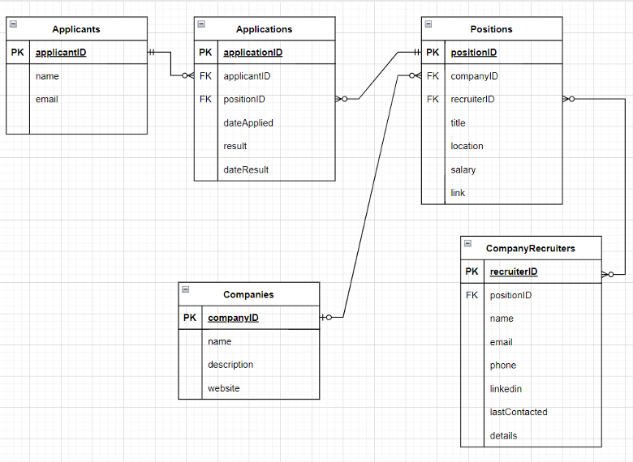
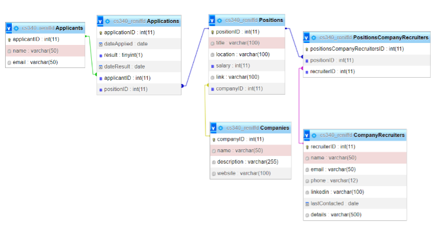

# DreamOffer
https://dream-offer.herokuapp.com/

## Description
DreamOffer is a DBMS admin portal for a Job Application Tracking web application. DreamOffer helps applicants keep track of the companies and positions they have applied to and when their applications were submitted, in an organized and simple to use system. CRUD functionality is built into each page/entity.

## Technology Used
- Python 3.11
- Flask
- MySQL
- HTML
- CSS
- Javascript

## Database Design
The database consists of 5 entities: Applicants, Applications, Companies, Positions, and Company Recruiters.

#### Entity Relationship Diagram (ERD)

#### Database Schema

## Usage

## Authors
Sophia Lilienthal & Don Reniff.
